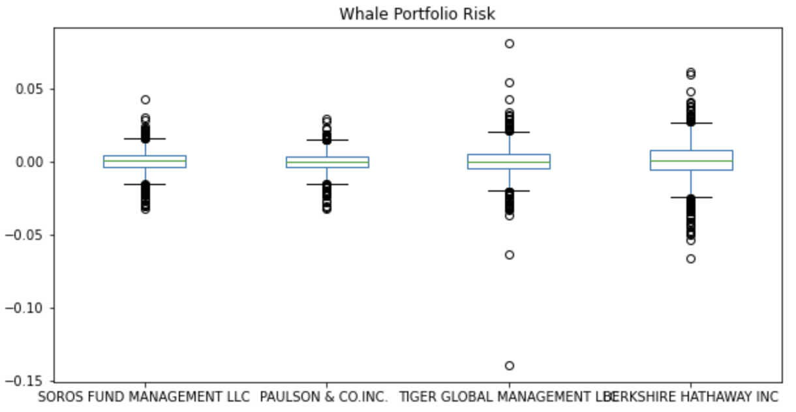
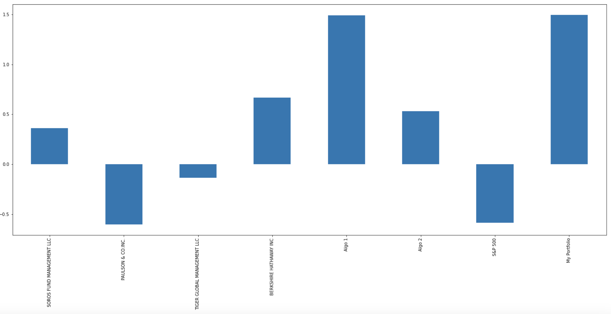

# Investment Portfolio Analysis

Analyzes and visualizes risk, returns, votality, and Sharpe ratios among various algorithmic, hedge, and mutual fund portfolios then compares them against the S&P 500 Index. At the end, the performance of my custom portfolio is evaluated and compared against the other portfolios as well as the S&P 500.

---

## Technologies

Language: Python3, Pandas 

Imports: pathlib, pandas, numpy, datetime, seaborn, and matplotlib libraries

External Resources: Google Finance, Google Sheets

Developed with JupyterLab

---

## Installation

JupyterLab - [Install JupyterLab](https://jupyterlab.readthedocs.io/en/stable/getting_started/installation.html)

---

## Examples

- Notebook reads in stock data via csv files located in Resources folder, cleans the data and visualizes financial analysis. Various examples include:
    1. Cumulative Return:
    
    2. Correlation:
    
    3. Standard Deviation:
    
    4. Sharpe Ratio:
    

---

## Contributors

Drew Disbrow Marnell: dldmarnell@gmail.com

---

## License

MIT License
Copyright (c) 2021 Drew Disbrow Marnell
